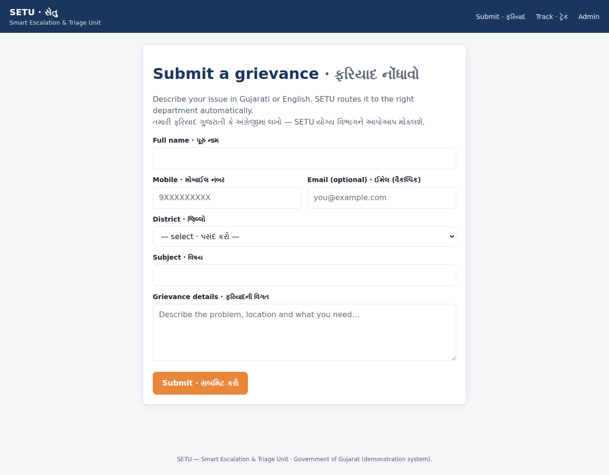
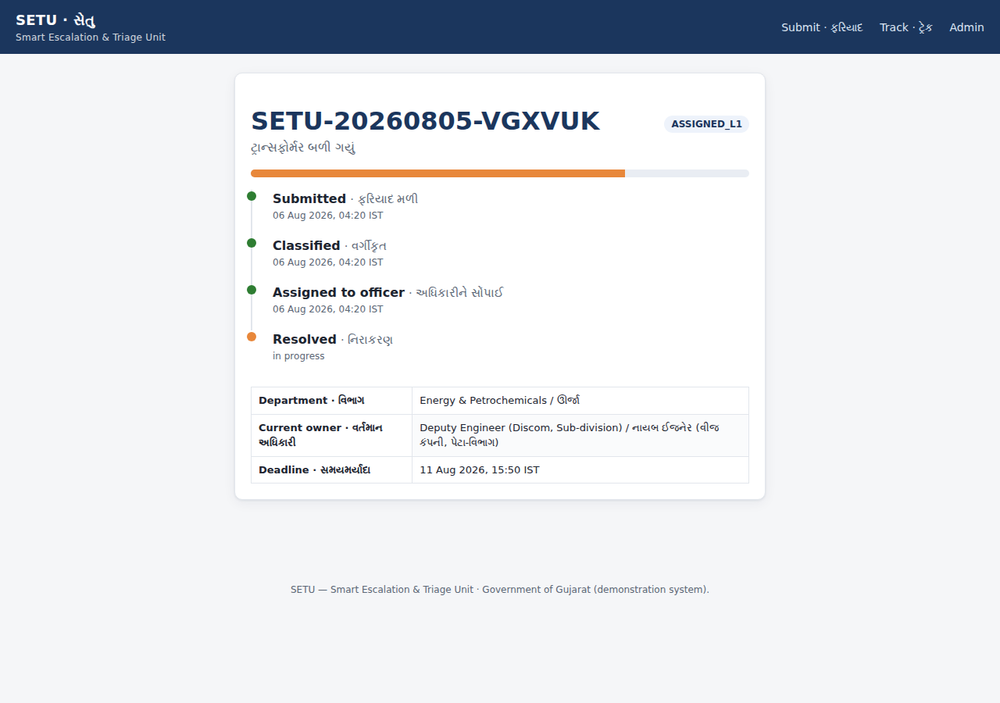
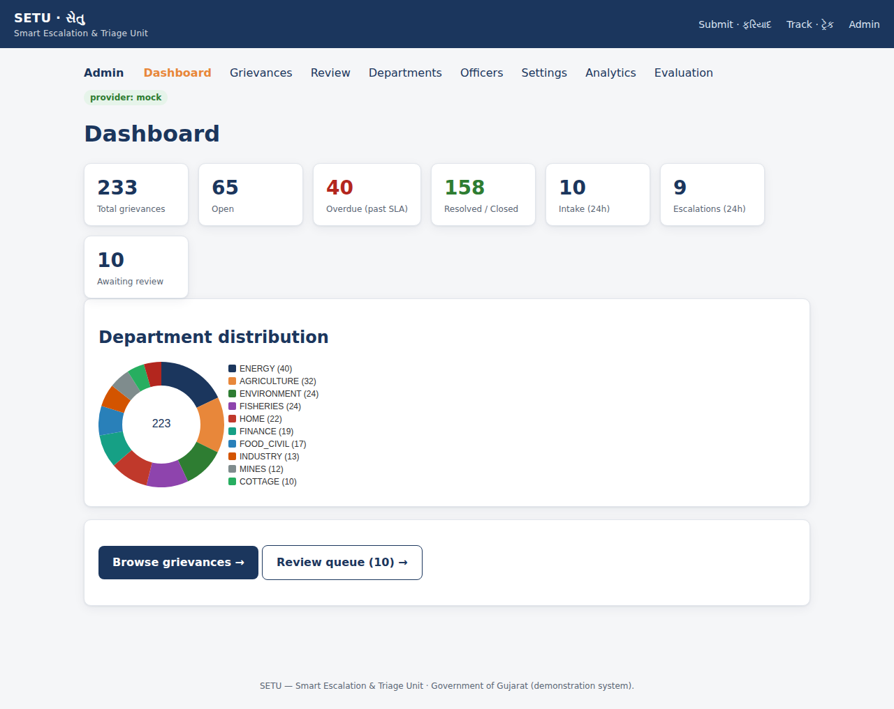
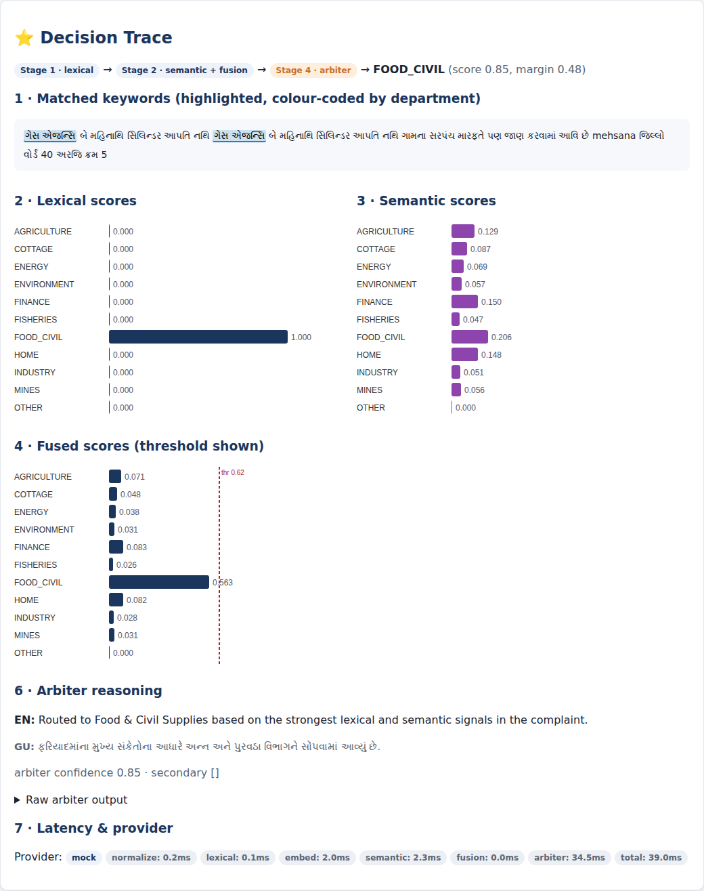
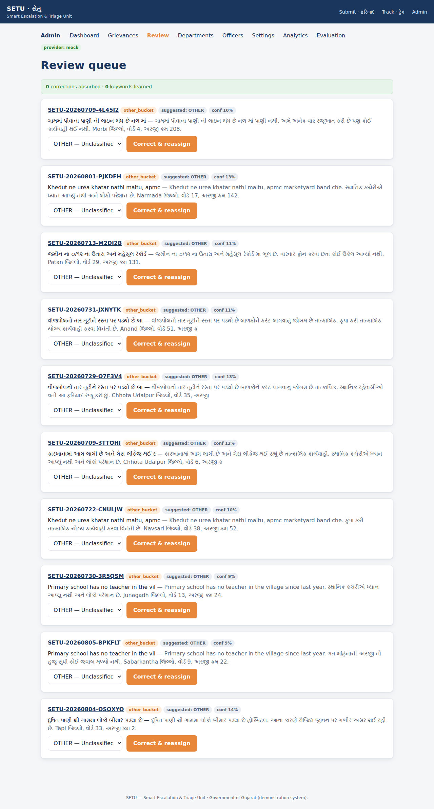
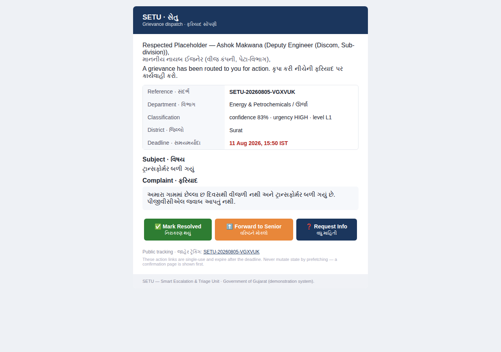

# SETU — Smart Escalation & Triage Unit · સેતુ ("bridge")

> Citizen grievance intake → automatic department classification → officer email
> dispatch → SLA-driven escalation → public status tracking. Built for the
> Gujarat State Government departmental grievance-redressal model, in Gujarati,
> English and romanised "Gujlish".

SETU is a bridge (સેતુ) between a citizen's complaint and the officer who can
fix it. A citizen writes in plain Gujarati; a three-stage classifier routes the
grievance to the right department; the assigned officer gets a bilingual email
with one-click action links; and if nobody acts in time, the SLA engine
escalates automatically — all observable on a public tracking page and an admin
console with a full **Decision Trace** for every classification.

**SETU runs fully offline.** The default configuration uses a *real*,
deterministic mock LLM provider — no API keys, no network, no Docker, no Node
build step. Point one environment variable at the BeyonData gateway to switch to
production models (bge-m3, gemma). Point another at SMTP to send real email.

## Quickstart (two commands)

```bash
pip install -r requirements.txt
make demo
```

`make demo` migrates the schema, seeds departments / keywords / officers /
holidays / the golden set, simulates a realistic month of ~220 backdated
grievances, runs the evaluation harness, and starts the server at
<http://localhost:8000> (admin console at `/admin`, default `admin` /
`setu-admin`; API docs at `/docs`).

## The two switches

| Switch | Env var | Default | Alternative |
| --- | --- | --- | --- |
| LLM provider | `LLM_PROVIDER` | `mock` (offline, deterministic) | `gateway` (BeyonData bge-m3 + gemma), `local` (sentence-transformers) |
| Email | `EMAIL_PROVIDER` | `console` (writes `.eml` + preview to `outbox/`) | `smtp` (Gmail app password) |

Nothing in the default demo touches the network. Switching to production is a
configuration change, not a code change — see `HANDOFF.md`.

## Architecture

```
 Citizen (Gujarati / English / Gujlish)
        │  POST /submit
        ▼
 ┌──────────────────────────────────────────────────────────────┐
 │ Classification cascade  (app/classification/)                  │
 │                                                                │
 │  Stage 0 normalize → Stage 1 lexical (Aho–Corasick)            │
 │        → Stage 2 semantic (centroids + cosine + softmax)       │
 │        → Stage 3 fusion + gate ── confident? ──► accept        │
 │                                    └ uncertain ─► Stage 4       │
 │                                        LLM arbiter (gemma)      │
 │  (urgency triage + duplicate detection run alongside)          │
 └───────────────┬────────────────────────────────────────────────┘
                 ▼
    Routing + dispatch (officer email, magic-link actions)
                 ▼
    SLA engine + APScheduler sweep ──► escalation L1→L2→L3
                 ▼
    Public tracking timeline   ·   Admin console + Decision Trace
```

Two provider Protocols (`LLMClient`, `EmailProvider`) isolate every external
dependency, so the offline mock and the real gateway/SMTP are interchangeable.

## Feature highlights

- **Three-stage cascade** — cheap lexical + semantic stages resolve the bulk;
  only the ambiguous minority (~15–30%) reaches the LLM arbiter.
- **Gujarati-first NLP** — Unicode NFC, i-matra variant folding, digit
  normalisation, romanised-Gujarati transliteration, whole-token Aho–Corasick
  matching with longest-match-wins.
- **12 known traps handled** — e.g. `કુટિર ઉદ્યોગ` → COTTAGE (not INDUSTRY),
  `મત્સ્યોદ્યોગ` → FISHERIES, `ગેસ એજન્સી` → FOOD_CIVIL. All covered by tests.
- **Explainable** — every classification stores a Decision Trace: matched
  keywords highlighted, per-stage score charts, the gate path, arbiter reasoning
  and per-stage latency.
- **SLA-driven escalation** — business-hours calendar, idempotent sweeper,
  `SLA_TIME_SCALE` for live demos.
- **Officer magic links** — signed, single-use, GET-safe resolve / forward /
  info actions; no officer accounts.
- **Active learning** — a human correction reassigns, re-dispatches, adds a dev
  sample, recomputes the centroid live and can learn new keywords.
- **Evaluation harness** — from-scratch NumPy metrics and a five-config ablation
  that quantifies the cascade's cost/quality trade-off.

## Evaluation summary (measured, mock provider, held-out test split)

| Config | Description | macro-F1 | accuracy | mean ms | LLM calls / 1k |
| --- | --- | ---: | ---: | ---: | ---: |
| A | Lexical only | 0.939 | 0.938 | 4.3 | 0 |
| B | Semantic only | 0.701 | 0.742 | 4.4 | 0 |
| C | Lexical + semantic fusion, no arbiter | 0.920 | 0.917 | 4.4 | 0 |
| **D** | **Full cascade (shipped)** | **0.929** | **0.928** | **14.2** | **175** |
| E | Arbiter only (every grievance to the LLM) | 0.818 | 0.866 | 61.9 | 1000 |

Config **D** reaches near-best quality while calling the LLM on only ~18% of
traffic; Config **E** calls it on 100% at ~4× the latency. Under the offline
mock embeddings the keyword-rich set favours the lexical configs — the semantic
stage improves markedly with a real model (`docs/evaluation.md` + the Phase-12
real-embedding table). Full report: `deliverables/evaluation_report.html`.

## Screenshots

| | |
| --- | --- |
|  |  |
|  |  |
|  |  |

## Project structure

```
app/            FastAPI app, config, models, state machine, vectors
  classification/  normalize · lexical · semantic · fusion · arbiter · pipeline · urgency · dedupe
  llm/             base · mock · gateway · local · factory · catalogue
  routing/         directory · dispatcher
  email/           base · console · smtp · threading · templates/
  sla/             calendar · engine · scheduler
  security/        tokens · auth
  evaluation/      metrics · runner · ablation · report
  routers/         public · actions · admin · api
  templates/       Jinja2 (base, public/, admin/, actions/)
  static/          css/app.css · js/htmx.min.js (vendored)
data/           departments.yaml · officers.seed.yaml · holidays.yaml · urgency.yaml · translit.yaml · golden_set.jsonl
scripts/        preflight.py · generate_golden_set.py · capture_screenshots.py
tests/          15 test files, 100+ tests
docs/           architecture · classification · evaluation · api · operations · screenshots/
deliverables/   project_dossier.html · evaluation_report.html
```

## Commands

```bash
make demo         # install-free full demo: migrate → seed → simulate → evaluate → serve
make run          # dev server with autoreload
make test         # run the test suite
make ablation     # five-config ablation table
make preflight    # connectivity + readiness report
python -m app.cli simulate --days 30 --count 220 --seed 42
```

## Roadmap

- Real BeyonData gateway (bge-m3 + gemma) via `LLM_PROVIDER=gateway`.
- PostgreSQL + pgvector (HNSW) for vector search past ~100k rows.
- Add the missing departments (Revenue, Health, Education, Water, R&B) to shrink
  the OTHER bucket.
- Citizen SMS/WhatsApp notifications; officer mobile acknowledgement.
- Vision model (`qwen2.5vl`) for photo-attachment triage.

See `HANDOFF.md` for the exact steps to production, `DECISIONS.md` for the
design rationale, and `DEMO_SCRIPT.md` for a 7-minute walkthrough.
